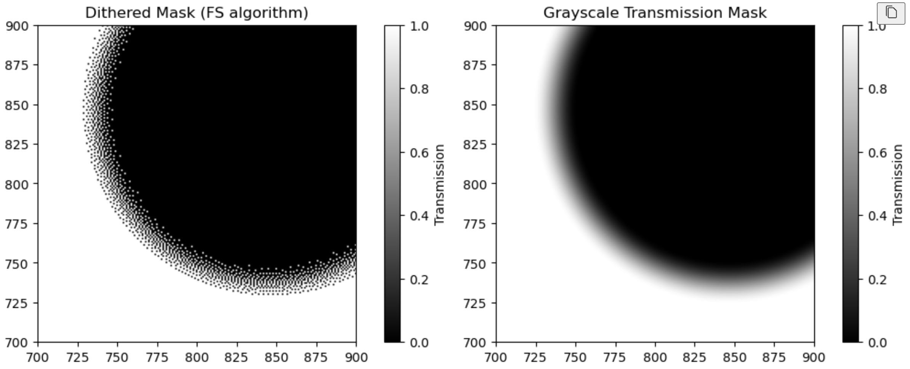
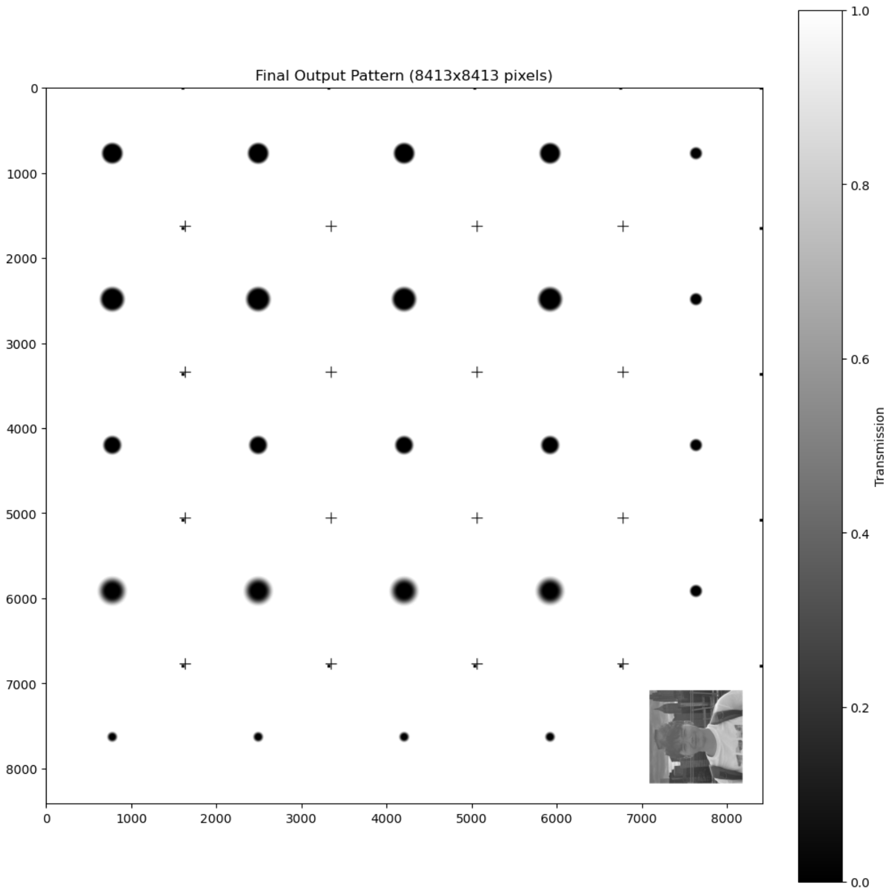

# Generate binary dithered photomasks from continuous transmission functions for lithography/fabrication.
dependencies: numpy, matplotlib, PIL, gdspy, numba, scipy. Optional: gdstk (for OASIS format, better compression)

## How does it work? 
1) Edit the transmission_function(), radial_function_to_image(), and generate_mask() according to your needs. You basically need to edit only the
the transmission function, and the other changes involve calling that function with the new parameters.
2) After this the whole process is automatical. Firstly, the dithering pattern is generated according to the [Floyd-Steinberg algorithm](https://en.wikipedia.org/wiki/Floyd–Steinberg_dithering),
and you can immediately visualize the produced pattern. The example for a cosine pattern with a zero tranmission in the center is given below

3) If you want several distinct dithered patterns on a single plate, you can do so by generating all the masks first, and then calling assemble_pattern_with_streets() with the given layout. The example is presented
below. As you can see you can also have alignment crosses at the edges of the dithered patterns, and if you need you mant to 'mark' some of them with a small black rectangle. 

4) The last stage involves converting this huge matrix of zeros and ones into .gds2 and .oas files that manufacturers usually require. This is also automatical and generates the two required files
saving a lot of memory and doing it chunks (to avoid memory overflow).

5) If you find bugs, please don't hesitate to contact me! 
